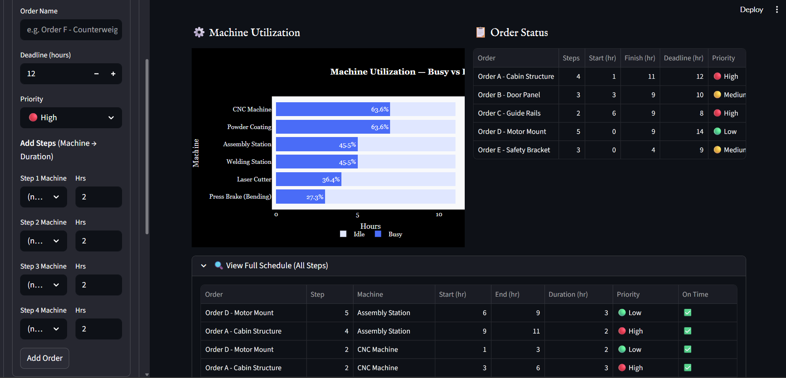
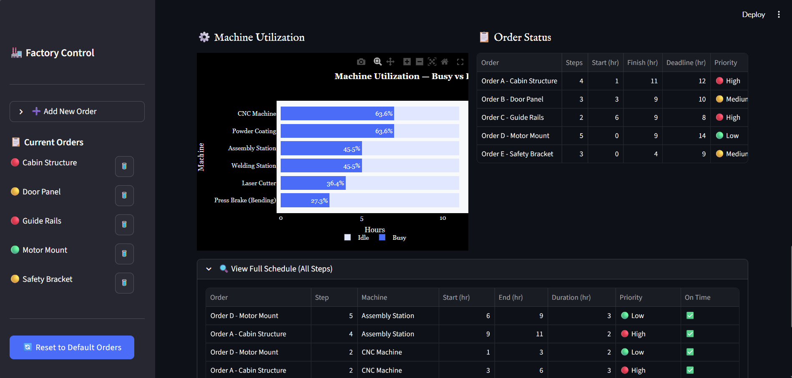
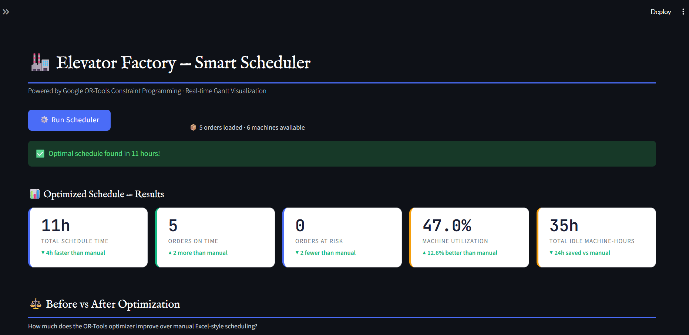
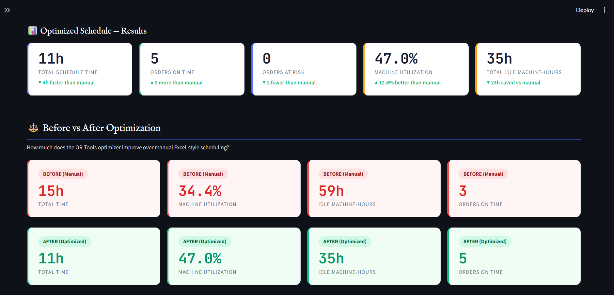
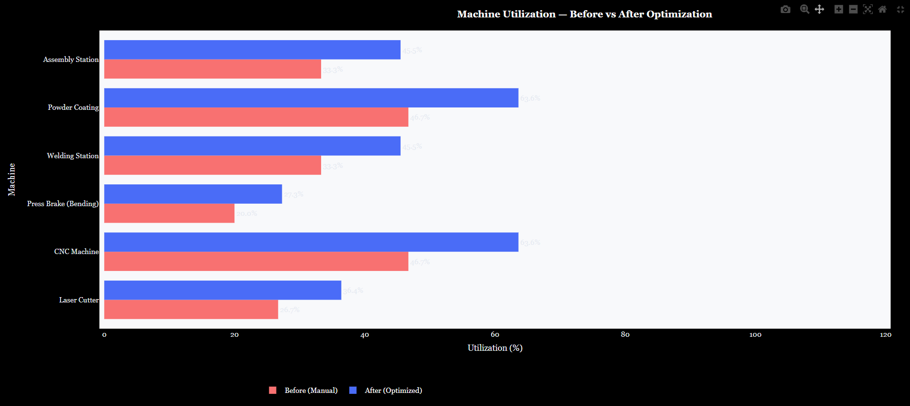
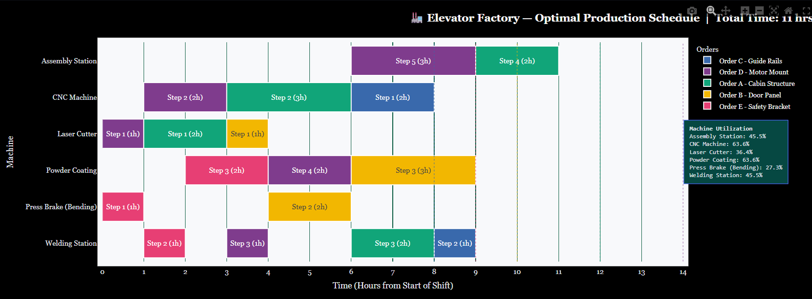
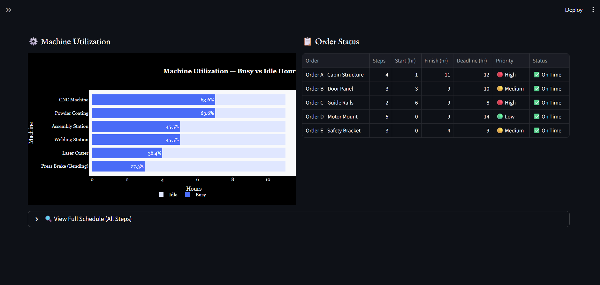
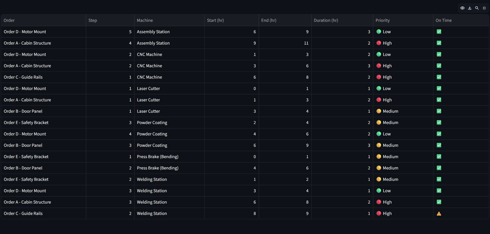

# Smart Process Scheduling and Monitoring System

The Elevator Factory Smart Scheduler is a Python-based production planning and visualization system designed to optimize manufacturing workflows in a home elevator production environment.

Traditional scheduling methods using spreadsheets and manual planning often lead to inefficient machine utilization, increased idle time, and delayed order completion. This project addresses these challenges by implementing an intelligent scheduling engine combined with an interactive dashboard.

---

## Overview

This project simulates a smart manufacturing workflow for an elevator factory. It builds an optimized production schedule, visualizes task sequencing with a Gantt chart, and displays machine utilization in a clean Streamlit dashboard.

---

## Features

- Optimizes job scheduling using Google OR-Tools
- Visualizes schedules with interactive Gantt charts
- Monitors machine usage and task order flow
- Easy local deployment with Streamlit
- Modular design separated into scheduling, visualization, and UI components

---

## Installation

1. Clone or download the repository.
2. Create and activate a Python environment.
3. Install dependencies:

```bash
pip install -r requirements.txt
```
---

## Usage

Run the dashboard with Streamlit:

```bash
streamlit run app.py
```

Then open the browser at `http://localhost:8501`.

---

## Project Structure

```text
Smart Process Scheduling and Monitoring System/
├── app.py            # Streamlit dashboard and user interface
├── scheduler.py      # Scheduling logic using OR-Tools
├── gantt.py          # Gantt chart and utilization chart generation
├── requirements.txt  # Python package requirements
└── README.md         # Project documentation
```

---

## How It Works

1. `scheduler.py` defines the production jobs, machine resources, and optimization model.
2. `gantt.py` converts the schedule into an interactive Plotly Gantt chart.
3. `app.py` loads the scheduling results and displays them in a Streamlit web app.

---

## Demo Screenshots

Below are sample views from the Streamlit dashboard and order workflow.

















🎥 **Demo Video:** [Watch on Drive](https://drive.google.com/file/d/1uMEgoSd3OrIWdRaorxuyQyuEU4NuI2_z/view?usp=sharing)

---

## Modeled Manufacturing Process

- Laser Cutting
- CNC Machining
- Press Braking / Bending
- Welding
- Powder Coating
- Assembly

---

## Sample Orders

The sample dataset includes a set of manufacturing orders such as:

- Cabin Structure
- Door Panel
- Guide Rails
- Motor Mount
- Safety Bracket

---

## Requirements

- Python 3.9+
- Streamlit
- Google OR-Tools
- Plotly
- Pandas

---

## Notes

- Modify `scheduler.py` to change job definitions, machine availability, or optimization parameters.
- Update `gantt.py` to customize chart appearance.
- Use the Streamlit interface in `app.py` for quick interactive monitoring.

---

## License

This repository is provided for educational and demonstration purposes.

---

## Author

Akash GS | Mechanical Engineering student exploring AI, computer vision, and applied Python development

---